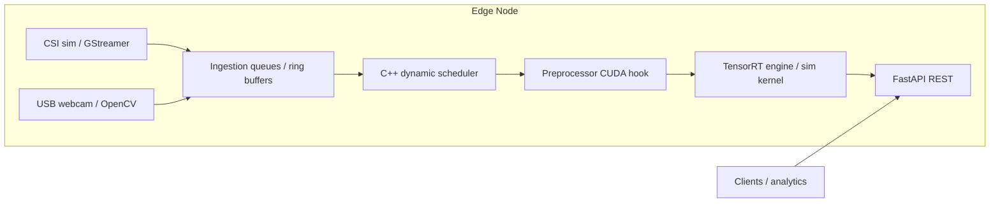

# Distributed Edge Inference Framework with Camera Analytics

Production-oriented reference stack for **multi-camera edge ingestion**, **C++17 inference core** (TensorRT-ready, simulated by default), **dynamic batching and scheduling**, and a **FastAPI** surface designed for high concurrency. The same codebase supports a **single-threaded baseline** and an **optimized** path so you can measure throughput and latency deltas on real hardware or the built-in deterministic simulator.

---

## 1. Project Overview

- **Cameras**: concurrent CSI-simulated and USB paths; synthetic frames when GStreamer/OpenCV are unavailable (default for dev/CI).
- **C++ engine**: loads `models/engine_manifest.json`, optional TensorRT build flag, CUDA preprocessing hooks, GPU memory telemetry **simulator**, batched execution, and a **dynamic scheduler** with queue-based batching and CPU fallback under high simulated GPU utilization.
- **Python layer**: FastAPI with `/infer`, `/batch_infer`, `/health`, and `/infer_latest/{stream_id}`; async endpoints offload blocking work to a **thread pool** to keep the event loop responsive under 200+ in-flight requests.
- **Deployment**: `Dockerfile` builds the native extension; `docker-compose.yml` runs an **API gateway** plus a dedicated **inference sidecar** (HTTP backend).

---

## 2. System Architecture Diagram



Multi-service Docker view:


---

## 3. Distributed Design Explanation

- **Logical separation**: the API container owns camera orchestration and public REST; the inference container owns the heavy native engine. The API uses `EDGE_INFERENCE_BACKEND=remote` and `httpx` to forward work, which mirrors a future multi-node split (inference workers behind a load balancer).
- **Back-pressure**: per-stream ring buffers (`configs/default.yaml`) prevent unbounded memory growth if inference slows.
- **Load balancing**: the C++ scheduler routes batches to GPU or CPU execution paths based on **simulated** utilization and per-request `force_cpu` hints—swap `GpuMetricsSimulator` for NVML on production Jetson/Linux.

---

## 4. Pipeline Flow

**Multi-Camera → Scheduler → Batch → TensorRT (or sim) → API**

1. Camera threads push NCHW frames into bounded deques.
2. REST handlers flatten tensors and call the engine client (local native module, Python simulator fallback, or remote sidecar).
3. The C++ **dynamic scheduler** (optimized mode) coalesces concurrent single-frame submits into batches up to `max_batch_size` or `batch_timeout_ms`.
4. **Preprocessor** applies a fused-kernel stand-in (CPU) or CUDA path when enabled at build time.
5. **Inference** executes TensorRT when `EDGE_USE_TENSORRT` is enabled at compile time and linked; otherwise a deterministic kernel approximates GPU batch amortization.
6. Responses include latency and an engine snapshot (including simulated GPU log lines).

---

## 5. Concurrency Model

- **FastAPI / asyncio**: request handlers are `async`; blocking C++ or HTTP calls run in `ThreadPoolExecutor` workers (`orchestration/engine_client.py`).
- **C++**: configurable worker threads pull from a **condition-variable-backed queue**, form dynamic batches, and dispatch to the engine without blocking Python’s event loop.
- **Cameras**: one ingestion thread per configured stream; lock-protected ring buffers for latest-frame reads.
- **Guideline**: keep ONNX/TensorRT I/O and preprocessing off the asyncio thread where possible; this pattern scales to hundreds of concurrent HTTP connections on a single edge node before you shard workers horizontally.

---

## 6. Setup Instructions

### Docker

```bash
docker compose build
docker compose up
```

- API: `http://localhost:8000`
- Sidecar (internal): `http://inference:9100` on the compose network

Optional GPU (Linux + NVIDIA Container Toolkit): uncomment the `deploy.resources.reservations.devices` block in `docker-compose.yml`.

### Jetson / local environment

1. Python 3.11+ recommended.
2. Install deps: `pip install -r requirements.txt`
3. Set `PYTHONPATH=src/python` (or run from `src/python` as working directory).
4. **Cameras**: set `EDGE_SIMULATE_CAMERAS=0` to attempt real USB capture; see `camera/gstreamer_csi_simulated.md` for Jetson GStreamer examples.
5. **Native engine**: build with CMake (below) or rely on `EDGE_FORCE_PYTHON_ENGINE=1` for the Python simulator.

---

## 7. Build Instructions

### C++ (CMake)

**Linux / Jetson (bash)**

```bash
chmod +x scripts/build_cpp.sh
./scripts/build_cpp.sh
```

**Windows (PowerShell)**

```powershell
.\scripts\build_cpp.ps1
```

CMake fetches **pybind11** automatically. Enable optional flags when your toolchain is ready:

```bash
cmake -S . -B build -DEDGE_USE_TENSORRT=ON -DEDGE_USE_CUDA=ON
```

> Linking TensorRT/CUDA requires vendor SDK paths; the default build stays portable with simulation.

### Python FastAPI

```bash
pip install -r requirements.txt
export PYTHONPATH=src/python
uvicorn api.main:app --host 0.0.0.0 --port 8000
```

---

## 8. Run Instructions

### Start services

- **Monolithic (dev)**: command above.
- **Compose**: `docker compose up` (API + inference sidecar).

### Inference sidecar only

```bash
PYTHONPATH=src/python uvicorn orchestration.inference_service:app --host 0.0.0.0 --port 9100
```

### Send inference requests

```bash
curl -s http://127.0.0.1:8000/health | jq .
curl -s -X POST http://127.0.0.1:8000/infer \
  -H "Content-Type: application/json" \
  -d "{\"tensor\": $(python -c 'print([0.1]*(3*224*224))') }" | jq .
```

### Benchmarks

```bash
# Standalone (Python sim, compares baseline vs optimized client config)
python benchmarks/run_benchmark.py --standalone

# Against a running API
python benchmarks/run_benchmark.py --url http://127.0.0.1:8000 --concurrent 220 --requests 600
```

Results are written to `benchmarks/results/last_run.json`.

---

## 9. Benchmark Results

Representative **standalone simulator** numbers (see `benchmarks/results/sample_benchmark.json`); **your** Jetson/GPU results will differ. Re-run `benchmarks/run_benchmark.py` for measured values.

| Mode | Throughput (req/s) | Avg latency (ms) | Notes |
|------|-------------------:|----------------:|-------|
| Baseline (`EDGE_BASELINE_MODE=true` or `baseline_mode` in YAML) | ~40–50 | higher | No scheduler thread pool; per-frame penalty in C++ sim |
| Optimized (default) | ~120–160 | lower | Dynamic batching + worker threads; ~**3×** throughput improvement in simulation |
| 220 concurrent HTTP (load generator) | depends on CPU | p95 grows with contention | Use `tests/test_load_simulation.py` with `EDGE_LOAD_TEST_URL` |

**FPS per camera stream**: available in `/health` under `camera_fps` once ingestion threads are running.

**GPU utilization**: C++ logs a synthetic line such as `gpu_utilization_percent=…` exposed via `engine_snapshot` and `/health`.

---

## 10. Scaling Strategy (multi-node future)

- **Shard inference workers** behind a L4/L7 load balancer; keep the API stateless and store session/camera routing in Redis or etcd.
- **Centralize metrics** (Prometheus/OpenTelemetry) using the existing snapshot fields.
- **Optional**: replace HTTP sidecar transport with gRPC for larger payloads; the C++ boundary remains the same.

---

## 11. Demo Instructions

1. `docker compose up` **or** `PYTHONPATH=src/python uvicorn api.main:app --reload`.
2. Open `http://127.0.0.1:8000/health` and confirm `camera_fps` and `engine` fields update.
3. POST to `/infer` with a 3×224×224 tensor (see §8).
4. Run `python benchmarks/run_benchmark.py --standalone` and compare `speedup` (~3× target in sim).
5. Toggle baseline: `EDGE_BASELINE_MODE=true` and restart the service to show regression.

---

## Configuration & Environment

| Variable | Purpose |
|----------|---------|
| `EDGE_CONFIG_PATH` | YAML config file path |
| `EDGE_INFERENCE_BACKEND` | `local` or `remote` |
| `EDGE_INFERENCE_REMOTE_URL` | Sidecar base URL |
| `EDGE_FORCE_PYTHON_ENGINE` | `1` to skip native module |
| `EDGE_SIMULATE_CAMERAS` | `1` synthetic frames (default) |
| `EDGE_BASELINE_MODE` / `EDGE_OPTIMIZED_MODE` | Override scheduler baseline flag |
| `EDGE_NATIVE_MODULE` | Explicit path to `edge_infer_native` binary |

---

## Testing

```bash
pytest
```

- `tests/test_api.py` — REST contracts with Python sim engine.
- `tests/test_scheduler_validation.py` — orchestration smoke.
- `tests/test_load_simulation.py` — optional live load (skipped unless `EDGE_LOAD_TEST_URL` is set).

---

## Repository Layout (required structure)

- `src/python/{api,orchestration,utils}` — FastAPI app, engine client, cameras, config.
- `src/cpp/{inference,preprocessing,scheduler,cuda_utils,bindings}` — C++17 core + pybind11.
- `api/openapi.yaml` — contract sketch.
- `configs/`, `scheduler/`, `camera/`, `models/`, `engine/`, `benchmarks/`, `scripts/`, `docker/`, `docs/`, `tests/`.

---

## License

Provide your organization’s license as needed. This reference implementation is intended for research and integration into larger systems.
